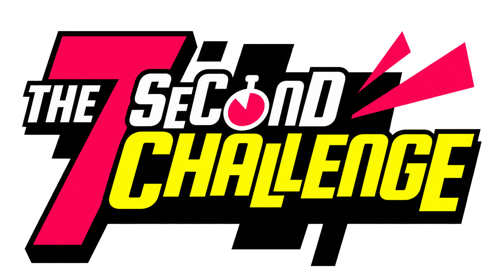

    <picture>
      
    </picture>

# The 7 Second Challenge

A native Android recreation of the 2015–2018 **7 Second Challenge** party game
(originally by Dan & Phil / Mind Candy). Pick a challenge, film your attempt on
camera against a 7-second countdown, and the app composes a shareable highlight
clip (title card → footage with a burned-in countdown → freeze-frame verdict).

> This repo currently distributes the built app only — the source isn't published yet.

## Install

1. Download **[`7-second-challenge-v0.0.26-beta.apk`](7-second-challenge-v0.0.26-beta.apk)**
   (or grab it from [Releases](../../releases)).
2. On your phone, allow installing apps from your browser / files app
   (*Settings → Apps → Special access → Install unknown apps*).
3. Open the APK and install.
4. Grant the camera + microphone permissions on first launch.

- **Requires:** Android 8.0 (API 26) or newer.
- **Size:** ~13 MB.
- `SHA-256`: `f97fc5fe7eee75bcfde9e2b6fbbd2e3463bd6b818fed5fc9a109426a52935541`

## Status

Working: Quick Play (solo / pass-the-phone), the full record → verdict → highlight-clip
flow, saved clips, and Options (sound, selfie-cam default, countdown length, video quality).

Coming soon: **Party Mode** (scored multiplayer) and the in-app **Videos** gallery —
both are disabled in this build.

## Notes

This is a non-commercial fan recreation made for playing at home. It is not affiliated
with, endorsed by, or connected to Dan Howell, Phil Lester, or Mind Candy. All fonts,
artwork, mascot, and sound effects in the app are original stand-ins written to match the
*character* of the original, not assets taken from it.
